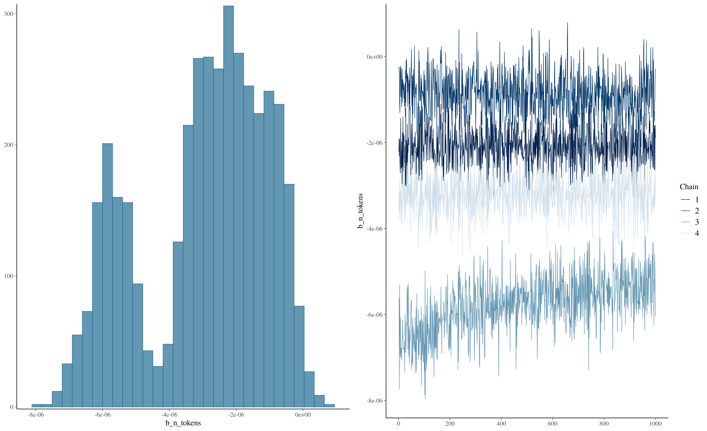
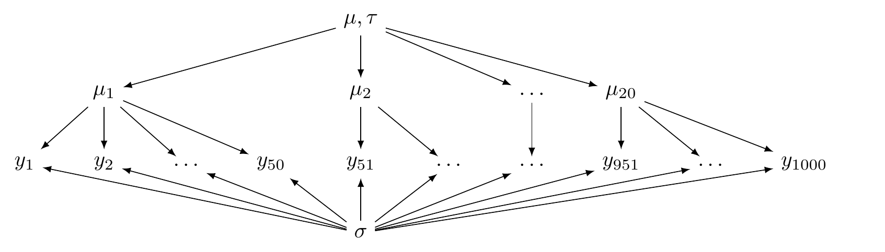
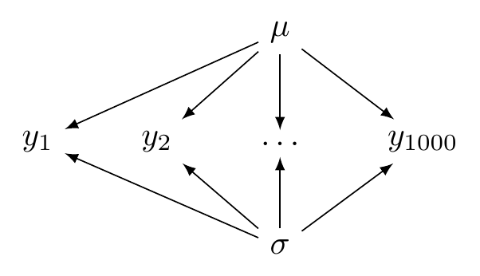
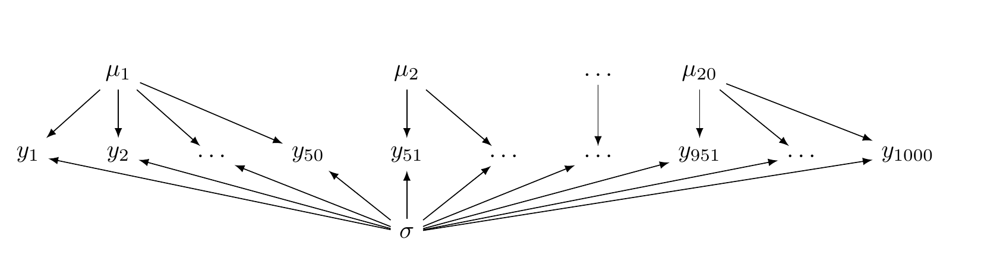

# Байесовский регрессионный анализ

```{r setup08}
#| include: false

knitr::opts_chunk$set(echo = TRUE, message = FALSE)
library(tidyverse)
library(brms)
theme_set(theme_bw())
```

```{r}
library(tidyverse)
```


В основном, мы до этого момента пытались оценить параметры распределения некоторой переменной, однако чаще  всего в научной литературе мы пытаемся оценить связь нескольких переменных. Регрессионный анализ как раз такой метод, который позволяет оценить связь некоторой переменной от некоторого набора зависимых переменных.

## Основы регрессионного анализа

```{r}
#| echo: false
#| warning: false

set.seed(42)
tibble(x = rnorm(150)+1) |> 
  mutate(y = 5*x+10+rnorm(100, sd = 2)) |> 
  ggplot(aes(x, y))+
  geom_point()+
  geom_hline(yintercept = 0, linetype = 2)+
  geom_vline(xintercept = 0, linetype = 2)+
  geom_smooth(method = "lm", se = FALSE)+
  annotate(geom = "point", x = 0, y = 10, size = 4, color = "red")+
  annotate(geom = "label", x = -0.5, y = 12, size = 5, color = "red", label = "intercept")+
  annotate(geom = "label", x = 2, y = 12.5, size = 5, color = "red", label = "slope")+
  scale_x_continuous(breaks = -2:4)+
  scale_y_continuous(breaks = c(0:3*10, 15))
pBrackets::grid.brackets(815, 420, 815, 545, lwd=2, col="red")
```

Когда мы используем регрессионный анализ, мы пытаемся оценить два параметра:

- свободный член (intercept) --- значение $y$ при $x = 0$;
- угловой коэффициент (slope) --- изменение $y$ при изменении $x$ на одну единицу.

$$y_i = \hat{\beta_0} + \hat{\beta_1}\times x_i + \epsilon_i$$

Причем, иногда мы можем один или другой параметр считать равным нулю.

При этом, вне зависимости от статистической школы, у регрессии есть свои ограничения на применение:

- линейность связи между $x$ и $y$;
- нормальность распределение остатков $\epsilon_i$;
- гомоскидастичность --- равномерность распределения остатков на всем протяжении $x$;
- независимость переменных;
- независимость наблюдений друг от друга.

Припомнив предыдущий раздел, мы можем представить связь и в другой нотации:

$$y_{n} \sim Normal(\mu = \hat{\beta_0} + \hat{\beta_1}\times x_{n}, \sigma =  \epsilon)$$

## Регрессионная модель в `brms`

::: {.callout-note}
В работе [@stepanova11] сообщается, что средняя скорость речи на русском языке составляет 5.31 слогов в секунду (стандартное отклонение 1.93). Скачайте [данные](https://raw.githubusercontent.com/agricolamz/2026_HSE_b_da4l/master/data/speech_tempo_zvenigorod.csv) корпуса г. Звенигород (<https://lingconlab.ru/zvenigorod/>) и оцените какой  эффект на скорость речи носителя `ea1976` оказывает разное количество гласных в высказывании, используя данные из [@stepanova11] в качестве априорного распределения. Визуализируйте получившееся распределение.
:::

```{r}
library(brms)
n_cores <- 15 # parallel::detectCores() - 1

read_csv("https://raw.githubusercontent.com/agricolamz/2026_HSE_b_da4l/master/data/speech_tempo_zvenigorod.csv") |> 
  filter(speaker == "ea1976") ->
  df

get_prior(speech_tempo ~ n_vowels, 
          family = gaussian(),
          data = df) 
```

Исходя из формулы выше, нам нужно определить априорное распределение для

- свободного члена;
- углового коэффециента;
- распределения остатков.

```{r fit1}
#| cache: true
#| message: false

fit1 <- brm(speech_tempo ~ n_vowels,
            data = df,
            family = gaussian(),
            cores = n_cores,
            silent = TRUE,
            prior = c(prior(normal(5.31, 1.93), class = "Intercept", lb = 0),
                      prior(normal(0, 1), class = "sigma", lb = 0),
                      prior(normal(0, 10), class = "b", lb = 0)))
```

После того, как функция отработала, мы можем проанализировать то, что мы получили в результате ее работы. Мы оценили три параметра:

```{r}
plot(fit1)
```

Стоит обратить внимание на сходимость цепей. Если все цепи накладываются друг на друга и выглядят как волосатые гусеницы --- все в порядке. Вот пример плохой сходимости цепей:

```{r}
#| echo: false


```

Видно, что цепи исследуют разное пространство и "устаканились" каждая на своем уровне. Кроме того, может быть такое, что цепи в принципе на одном уровне, но где-нибудь по середине делает скачок в сторону, а потом возвращается.

Метрики модели можно посмотреть, просто вызвав переменную с моделью.

```{r}
fit1
```

Метрики качества модели: R-hat, Bulk_ESS и Tail_ESS

R-hat -- это диагностика сходимости, которая сравнивает оценку модели, которая получается внутри цепи и между цепями (введена в [@gelman92]). Если цепи не перемешались (например, если нет согласия внутри цепи и между цепями) R-hat будет иметь значение больше 1. Собственно для этого рекоммендуется запускать по-крайней мере 4 цепи. Stan возвращает что-то более сложное, что называется maximum of rank normalized split-R-hat и rank normalized folded-split-R-hat, однако мы не будем в этом разбиратсья, отсылаю к [статье](https://arxiv.org/abs/1903.08008) или [к посту](https://statmodeling.stat.columbia.edu/2019/03/19/maybe-its-time-to-let-the-old-ways-die-or-we-broke-r-hat-so-now-we-have-to-fix-it/) в блоге одного из авторов с объяснением.

**Самое главное**: $\hat{R} \leq 1.05$ -- значит проблем со сходмиостью цепей не обнаружено.

Bulk ESS (Effective sample size) --- это оценка качества сэмплирования в середине апостериорного распределения, а Tail ESS --- в краях апостериорного распределения. Чем выше ESS -- тем лучше.

Мы можем визуализировать полученную регрессию:

```{r}
fit1 |> 
  conditional_effects() |> 
  plot(points=TRUE)
```

Мы можем визуализировать, насколько скорость речи в данных соотносится с полученным распределением апостериорного распределения:

```{r}
fit1 |> 
  pp_check(type = "dens_overlay", ndraws = 50)

fit1 |> 
  pp_check(type = "stat")
```

Если хочется предсказать какие-то значения, то можно использовать функцию `predict()`, которая возьмет выборки из апостериорного распределения:

```{r}
predict(fit1, newdata = tibble(n_vowels = c(10, 20)))
```


## Альтернативная модель

Мы можем использовать тот же самый код, но попробовать в качестве переменной использовать логорифм количества гласных. Для того, чтобы использовать какие-то арифемтические операции внутри регрессионной формулы, нужно использовать функцию `I()` или сделать какие-то модификации переменных до того, как использовать в регрессии. 

```{r}
get_prior(speech_tempo ~ I(log(n_vowels)), 
          data = df, 
          family = gaussian())
```


```{r fit2}
#| cache: true
#| message: false

fit2 <- brm(speech_tempo ~ I(log(n_vowels)), 
            data = df,
            family = gaussian(),
            cores = n_cores,
            silent = TRUE,
            prior = c(prior(normal(5.31, 1.93), class = "Intercept", lb = 0), 
                      prior(normal(0, 1), class = "sigma", lb = 0),
                      prior(normal(0, 10), class = "b", lb = 0)))
```

```{r}
plot(fit2)
```

```{r}
fit2 |> 
  conditional_effects() |> 
  plot(points=TRUE)
```

```{r}
fit2 |> 
  pp_check(type = "dens_overlay", ndraws = 50)

fit2 |> 
  pp_check(type = "stat")
```

В работах [@vehtari2017; @vehtari2024] описан метод `loo`, который оценивает leave-one-out кроссвалидацию, которую можно использовать для сравнения моделей.

```{r}
fit1 <- add_criterion(fit1, "loo")
fit1$criteria$loo
fit2 <- add_criterion(fit2, "loo")
fit2$criteria$loo
loo_compare(fit1, fit2, criterion = "loo")
```

Большее значение ELPD стоит интепретировать как лучшую предсказательную способность модели. Подробнее про эту метрику можно прочитать, запустив `help('pareto-k-diagnostic')`. Еще больше на [странице пакета `loo`](https://mc-stan.org/loo/).

::: {.callout-note}
В работе [@coretta2016] собраны [данные](https://raw.githubusercontent.com/agricolamz/2024_HSE_b_da4l/master/data/Coretta_2017_icelandic.csv) длительности исландских гласных. Используя байесовскую регрессию с априорными распределениями по умолчанию, смоделируйте длительность гласного (`vowel.dur`) в зависимости от придыхания (`aspiration`) у носителя `tt01`. Визуализируйте результаты модели.
:::

```{r}
#| include: false
read_csv("https://raw.githubusercontent.com/agricolamz/2024_HSE_b_da4l/master/data/Coretta_2017_icelandic.csv") |> 
  filter(speaker == "tt01") -> 
  vowels
  
vowels |> 
  ggplot(aes(aspiration, vowel.dur))+
  geom_violin()

get_prior(vowel.dur ~ aspiration,
          data = vowels)
```

```{r vowels_fit}
#| include: false
#| cache: true

vowels_fit <- brm(vowel.dur ~ aspiration,
                  data = vowels,
                  cores = n_cores,
                  silent = TRUE)
vowels_fit
```


```{r}
#| echo: false

plot(vowels_fit)

vowels_fit |> 
  conditional_effects() |> 
  plot(points=TRUE)
```

## Иерархические модели

Одним из важных предположений регрессионного анализа является независимость наблюдений друг от друга. Однако часто в данных можно встретить различные группировки наблюдений, которые следует учитывать. В статистическом моделировании принято различать разные методы для борьбы с независимостью наблюдений. Во-первых, группировку можно разметить и добавить в основные эффекты регрессии. Если эта группировка как-то важна для исследования, то оценка параметров такого варьирования будет иметь смысл. Однако бывают такого рода группировки, которые нам неинтересно вставлять в основные эффекты регрессии: нам хочется сделать обобщение внутри группировки, а потом построить обобщение над обобщениями. Использование такого рода модель позволяет

- признать, что в данных есть нарушение независимости наблюдений друг от друга;
- учесть эффект группировок;
- и абстрагироваться от группировок, делая предсказания в том числе для таких уровней группы, которых мы еще не наблюдаем в наших данных.

Такого рода модели называют моделями со смешанными эффектами. При моделировании при помощи моделей со случайными эффектами различают:

- *основные эффекты* -- это те связи, которые нас интересуют, независимые переменные (скорость речи, наличие придыхания...);
- *случайные эффекты* -- это те переменные, которые создают группировку в данных (корпус, носитель, стимул и т. п.).

В результате моделирования появляется обобщенная модель, которая игнорирует группировку, а потом для каждого значения случайного эффекта генерируется своя регрессия, отсчитывая от обобщенной модели как от базового уровня.

```{r}
#| echo: false
#| fig-cap: "Из 'Introduction to Bayesian Data Analysis for Cognitive Science' Bruno Nicenboim, Daniel J. Schad, and Shravan Vasishth"


```

В заданиях выше, когда мы предсказывали скорость речи, мы все время отфильтровывали одного конкретного носителя и делали модель для него. Это связано с тем, что носитель --- это образцовый пример случайного эффекта. Давайте теперь попробуем смоделировать скорость речи для всех носителей из звинигородского корпуса

```{r}
df <- read_csv("https://raw.githubusercontent.com/agricolamz/2026_HSE_b_da4l/master/data/speech_tempo_zvenigorod.csv")
```

Случайные эффекты записываются в круглых скобках. Почему перед ним тоже нужно писать 1 (что означает интерсепт) станет ясно из примеров ниже. Давайте сравним априорные распределения по-умолчанию, которые предлагает `brms` для моделей со смешанными эффектами и для моделей без них:

```{r}
get_prior(speech_tempo ~ 1,
          data = df,
          family = gaussian())

get_prior(speech_tempo ~ (1|speaker),
          data = df,
          family = gaussian())
```

Как видно добавились много параметров `sd`, которыми принято обозначать параметры вариативности модели внутри групп, в то время как `sigma` продолжает быть параметром, определяющим вариативность между группами.

```{r hierarchical}
#| cache: true
#| message: false

fit_hierarchical <- brm(speech_tempo ~ (1|speaker),
                        data = df,
                        family = gaussian(),
                        cores = n_cores,
                        silent = TRUE,
                        prior = c(prior(normal(5.31, 1.93), class = "Intercept", lb = 0),
                                  prior(normal(2, 5), class = "sigma", lb = 0),
                                  prior(normal(2, 10), class = "sd")))
```

```{r}
fit_hierarchical

plot(fit_hierarchical)
```

В случаях, когда у нас нет предикторов, визуализация параметров иллюстрирует необходимые распределения.

## Другие варианты моделей с группировками

### Complete pooling model

```{r}
#| echo: false
#| fig-cap: "Из 'Introduction to Bayesian Data Analysis for Cognitive Science' Bruno Nicenboim, Daniel J. Schad, and Shravan Vasishth"


```

```{r complete_pooling}
#| cache: true
#| message: false

fit_complete_pooling <- brm(speech_tempo ~ 1,
                            data = df,
                            family = gaussian(),
                            cores = n_cores,
                            silent = TRUE)
```

```{r}
fit_complete_pooling

plot(fit_complete_pooling)
```

### No pooling model

```{r}
#| echo: false
#| fig-cap: "Из 'Introduction to Bayesian Data Analysis for Cognitive Science' Bruno Nicenboim, Daniel J. Schad, and Shravan Vasishth"


```

```{r no_pooling}
#| cache: true
#| message: false

fit_no_pooling <- brm(speech_tempo ~ 0 + speaker,
                      data = df,
                      family = gaussian(),
                      cores = n_cores,
                      silent = TRUE,
                      prior = c(prior(normal(2, 5), class = "sigma", lb = 0),
                                prior(normal(0, 10), class = "b", lb = 0)))
```

```{r}
fit_no_pooling

plot(fit_no_pooling)
```

